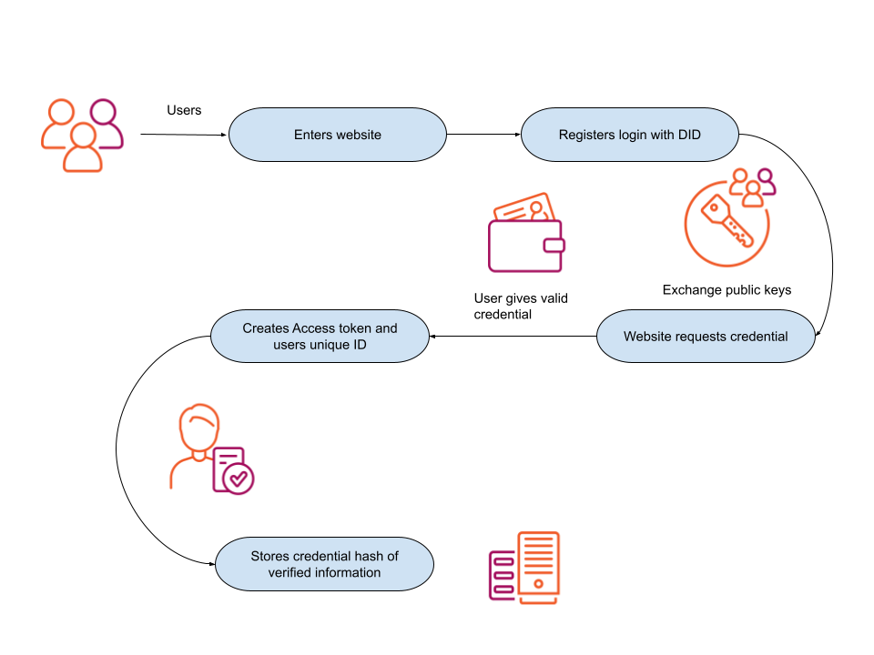

# Web3 Verification Credential Login

The following code is example code and requires the user to add business logic and security to the application.

The flow from the application



## What can you do with the KILT credential?

The Web3 DID login with credential verification gives a new flow for authentication by giving the control of the users' data back into their hands, whilst providing utility to the builders of the application and unloading the burden of managing and securing users' personal data.

You can make applications that require credentials to access parts of the services. The application leverages users' DIDs, which allow creating a secure session between the client and the backend of the application through the frontend as messaging service.

One example of the KILT Credential is the web3 Login service. We will explore that in this repository.

For example, having a credential for the user's information, the database links the user DID or KILT Credential to specific hashes of a stored credential. When someone wants to make a purchase, they can provide the data to the site and not rely on a centralized service.
		
The user visits a website and wants to use a service. A trust exchange between the application and user happens by providing the credential. The website would accept a credential issued by a trusted entity, and the application can validate the credentials information using the KILT blockchain.

Once confirmed, the application can forget the personal data if needed and create a unique login with the KILT Credential hash plus other information, such as a password. 
		
A user can buy an item from the store or use a service requiring personal data about the user. The user can submit the matching credential to prove ownership without the website storing personal information. If needed, the website can request a new credential to provide more data associated with a given CType. The website validates the information, creates the order, issues an invoice, and deletes all personal information afterwards. The user benefits from a convenient way of providing the website with the reliable information it needs for processing its order while retaining control and knowing that the website isn't tracking its data or external entities.
		

Entities can benefit from holding a DID and credentials to form a trust exchange. Let's look at the credential login process now and go over each step and where you can take the code and add it to your existing project or start from scratch from this point.

## Disclaimer

This code is not for production use. It serves as an example workflow for accepting Credentials.

## Getting Started

Let's get going! Let us see how you can start a web3 DID login with credentials verification.

### Requirements

`Node` installed and the [sporran wallet](https://github.com/BTE-Trusted-Entity/sporran-extension/tree/main) added to your browser (currently works with Firefox and Chromium-based browsers).
We recommend using the internal/testing version of Sporran for development purposes, which allows you to connect to the Peregrine testnet.
Follow the steps in the sporran wallet repository to build and install.


### Setup

Clone the repository and go into the folder or you can set up a whole project from start to finish following the  [KILT Distillery CLI](https://github.com/KILTprotocol/kilt-distillery-cli/).

To set up the application several environment variables and files must be set up manually or through the Distillery:

- .env
- didConfiguration.json

### Environment variables

The following variables must be generated. This can be done via the Distillery or manually.

```js
DAPP_NAME='NAME OF APPLICATION'
JWT_SECRET='JSON WEB TOKEN SECRET HERE'
JWT_EXPIRY='TIME WITH DENOMINATION E.G. Seconds (s) or Hours (h) or days (d)'
JWT_RENEW='TRUE or FALSE'
ORIGIN='DOMAIN AT WHICH THE APPLICATION CAN BE ACCESSED, E.G. HTTP://LOCALHOST:3000'
WSS_ADDRESS='URL OF THE FULL NODE TO CONNECT TO'
VERIFIER_MNEMONIC='Enter your twelve word mnemonic phrase here'
VERIFIER_ADDRESS='Enter your address'
VERIFIER_DID_URI='Enter your DID URI'
```

#### Blockchain address

Before you call any SDK functionality, you need to initialize the crypto libraries and configure the SDK. For the project, we'll be using Peregrine Testnet. This is done by calling await Kilt.init({ address }) where address is the address of the full node you want to connect to. For the project, use `wss://peregrine.kilt.io/parachain-public-ws`. Add the address to your `.env` file as `WSS_ADDRESS`.

#### JSON Web token

Covering the JSON web token, known as JWT, management, and creation is out of the scope of the project.

#### Verifier Setup

In order to use the web3 login, the service needs its own DID and must provide a [well-known domain linkage credential](https://identity.foundation/specs/did-configuration/). A well-known domain linkage credential provides a credential for users to verify the domain belongs to the given service. Creating a way to share public keys with the application and user. The DID configuration is used to prevent replay attacks and man-in-the-middle attacks, more details can be found in the [credential Api specification](https://github.com/KILTprotocol/credential-api#man-in-the-middle).

You can create and attest your well known domain linkage credential or you can use the verification setup tool in the [KILT Distillery CLI](https://github.com/KILTprotocol/kilt-distillery-cli/).

After you have created the well-known domain linkage for the application, you will need to add it to the `.env` file as shown below

```BASH
VERIFIER_MNEMONIC="Enter your twelve word mnemonic phrase here "
VERIFIER_ADDRESS=Enter your address
VERIFIER_DID_URI=Enter your DID URI
```

Now you can add the well-known domain linkage credential, `/.well-known/did-configuration.json`, to the `public` folder in the application source code. The credential must be issued by and to the verifier DID.

```JSON
{
  "@context": "https://identity.foundation/.well-known/did-configuration/v1",
  "linked_dids": [
    {
      "@context": [
        "https://www.w3.org/2018/credentials/v1",
        "https://identity.foundation/.well-known/did-configuration/v1"
      ],
      "issuer": "did:kilt:4o3zUbeEowBHbAu4aLsNXyNQHEw16KZbinLyd6BwXVkzdJKn",
      "issuanceDate": "2022-04-07T07:54:39.384Z",
      "expirationDate": "2027-04-06T07:54:39.386Z",
      "type": [
        "VerifiableCredential",
        "DomainLinkageCredential",
        "KiltCredential2020"
      ],
      "credentialSubject": {
        "id": "did:kilt:4o3zUbeEowBHbAu4aLsNXyNQHEw16KZbinLyd6BwXVkzdJKn",
        "origin": "http://localhost:3000",
        "rootHash": "0x54da9dd88fdf83063d6549295721c84ab59f9d802f49ebfb20e5a00e250625ec"
      },
      "proof": {
        "type": "KILTSelfSigned2020",
        "proofPurpose": "assertionMethod",
        "verificationMethod": "did:kilt:4o3zUbeEowBHbAu4aLsNXyNQHEw16KZbinLyd6BwXVkzdJKn#0x5e7ea14081452641c4970081552f774d4b2495ce918ddc0e35fd50735e5d7e1c",
        "signature": "0x044fe1502df8e9c057f016986826c8e3108d8c8dcae055af041f9fa51ce34a201d6c4428242fb6d6690fc3833f040b3e5c91b94c997e7a4232f5c5ee1ca7eb89"
      }
    }
  ]
}

```

### Running the application

Now the application's necessary components have been added to the project, you can run the following commands to spin up the project.
Now install with the following command:

```js
npm run install 
```

Once you have installed the application and the environmental variables are set up from the [verifier setup](#verifier-setup), you can now start the application with the following command:

```js
npm run dev
```

## API Authorization

API endpoints require the user to be logged in. You can ensure this by checking the http-only cookie. See `/pages/api/secret.js` as an example.

``` javascript
export default function handler(req, res) {
  // get the user from http-only cookie
  const cookie = `token=${req.cookies.token}`
  const user = getCookieData({ name: 'token', cookie })

  // deny if not logged in
  if (!user) return res.status(401).send('unauthorized')
  
  // add more auth/business logic here if you need...
 
  res.status(200).send('"It might make sense just to get some in case it catches on." — Satoshi Nakamoto')
}
```

## Page Authorization

Pages leverage NextJS middleware to protect against unauthorized access. See `/pages/member/_middleware.js` as an example.

``` javascript
export function middleware(req) {
  // get the user from http-only cookie
  const cookie = `token=${req.cookies.token}`
  const user = getCookieData({ name: 'token', cookie })

  // deny if not logged in
  if (!user) return new NextResponse('unauthorized')
    
  // or you can redirect gracefully
  if (!user) return NextResponse.redirect('/')

  // add more auth/business logic here if you need...
    
}
```
